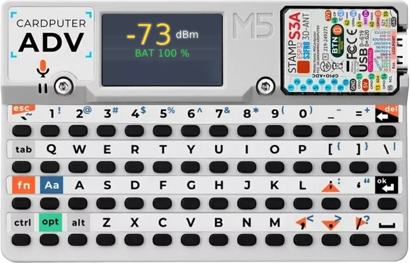
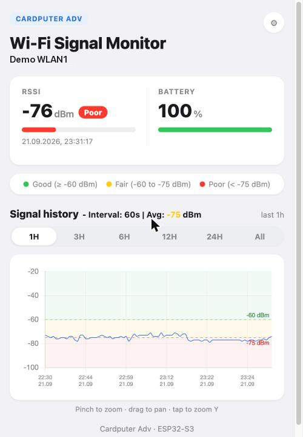
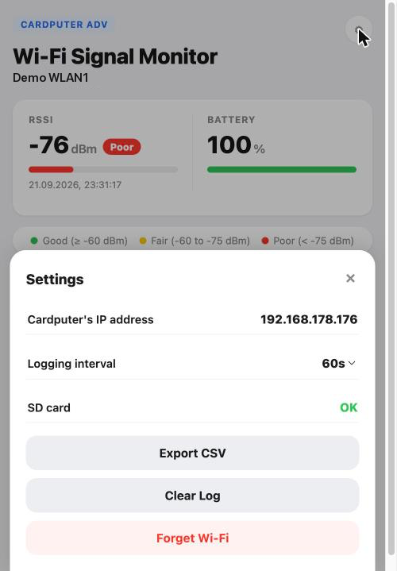

# WiFi Signal Monitor

A pocket WiFi signal logger for the M5Stack Cardputer Adv. Walk around and watch RSSI update live on-device, then check a web dashboard for the full history per network — no phone app or cloud service needed.

An Arduino (C++) sketch for the [M5Stack Cardputer Adv](https://docs.m5stack.com/en/core/Cardputer-Adv) — a pocket ESP32-S3 dev board with keyboard, screen, mic/speaker, and IMU.

Joins your home WiFi, logs signal strength (RSSI) to the SD card at an adjustable interval (5s/10s/30s/60s, default 60s) with a real timestamp (NTP), and serves a live + historical chart over the network.

Each network gets its own log file (`/wifi_signal_monitor/<ssid>.csv` on the SD card), so switching WiFi networks doesn't mix their signal history together.

The WiFi password is entered on-device via the keyboard (scan and pick an SSID, or type one manually) and stored in flash — never hardcoded. It's saved as plaintext in NVS flash (no ESP32 flash encryption enabled); it never leaves the device over the network, but anyone with physical/USB access to the flash chip can read it back out.

The on-device RSSI readout intentionally shifts position slightly between updates — that's screen burn-in protection, not a glitch.

Press **I** at any time to overlay the device's IP address — where the web dashboard is served — for 5 seconds before it reverts to the normal readout.



The dashboard shows the connected SSID, RSSI and battery with Good/Fair/Poor status pills, and a signal history chart with a 1H/3H/6H/12H/24H/All range picker and a color-coded average RSSI for whatever's currently visible. The full log is always loaded, so pinch-to-zoom and drag-to-pan can scroll arbitrarily far back through history, not just within the selected range; tapping the chart toggles a tight y-axis fit around the visible data. The gear icon opens a settings panel showing the device's IP address, SD card health (OK / Not available), a logging interval picker, an "Export CSV" button to download the current network's full log, a "Clear Log" button to reset the current network's history, and a "Forget Wi-Fi" button.

The web dashboard can be added to your phone's home screen (iOS "Add to Home Screen") for a fullscreen, no-browser-chrome app-like view with its own icon and title.

 

Code: [`wifi_signal_monitor`](wifi_signal_monitor)

## Flashing a precompiled release

No Arduino IDE needed. Grab the latest `.bin` from [Releases](../../releases), then:

```
pip install esptool   # if you don't already have it
esptool.py --chip esp32s3 --port /dev/cu.usbmodemXXXX write_flash 0x0 wifi-signal-monitor-vX.Y.Z.bin
```

(On Windows/Linux the port looks like `COM3` or `/dev/ttyACM0`.) Insert a FAT32-formatted microSD card before powering on for RSSI logging + history; without one, the device shows a warning and continues on to WiFi setup and the live dashboard, just without logging or history. First boot walks you through WiFi setup on the device's own keyboard.

### Typing on the device's keyboard

- **Letters/digits** type normally, lowercase by default.
- **Aa** (the blue key, bottom-left area) is Shift — hold it while pressing a letter or symbol key for the uppercase/shifted character (e.g. `1` → `!`). There's no caps-lock toggle; it's held-per-keystroke only.
- **del** (top-right key) is Backspace.
- **ok** (the enter key, right side of the third row) confirms the SSID or password field.

## Hardware

- **SoC:** ESP32-S3FN8, Xtensa LX7 dual-core @ 240MHz, 8MB flash, WiFi/BLE
- **Display:** 1.14" 240x135, ST7789V2 controller
- **Keyboard:** 56-key matrix (4x14), via TCA8418RTWR I2C keyboard controller
- **Storage:** microSD slot (SPI, must be FAT32-formatted)
- **Battery:** 1750mAh Li-ion, ADC on G10

## Dev platform

Arduino IDE (or `arduino-cli`) with the [M5Cardputer library](https://github.com/m5stack/M5Cardputer), which pulls in M5Unified/M5GFX. Board: `esp32:esp32:esp32s3`.
